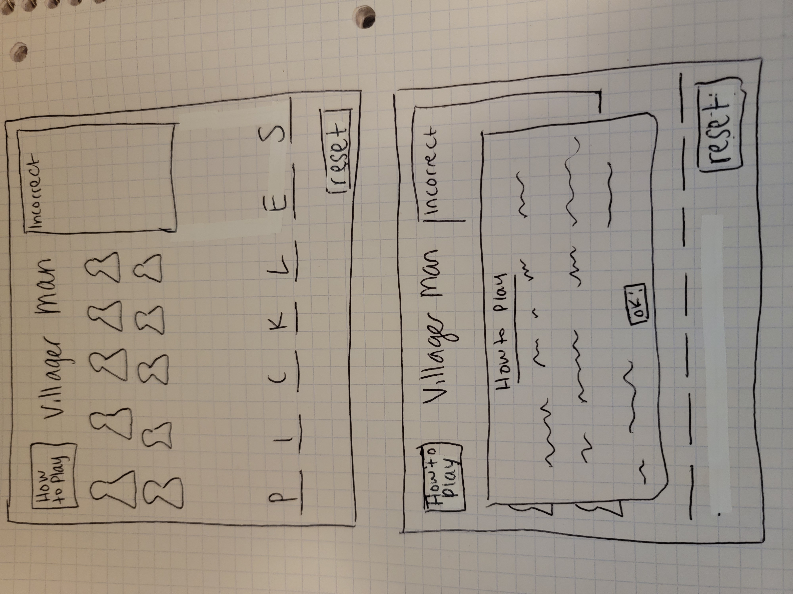

# Villager Man

## Description

A browser-based Spaceman game (with an Animal Crossing twist) coded in JavaScript, HTML and CSS.

## Planning Process

### User Stories

#### MVP

- As a user, I want a browser-based interface so that I can play the game.
- As a user, I want to be able to enter a word (between three and eight characters in length) for another player to guess.
- As a user, I want to see a villager image leave if a letter is guessed incorrectly (start with 10 villagers). There should be a lose state with a reset button.
- As a user, I want to see a letter appear in the word space if it was guessed correctly.
- As a user, I want the game to reach a win state so I know that the word is complete and no more letters can be guessed.
- As a user, I want the other play to be able to guess a letter using their keyboard.
- As a user, I want incorrect letters to stay on the screen in a container.
- As a user, I want to have instructions available if someone is not sure how to play.

#### Bronze

- As a user, I want to be able to see how long it takes for the second player to guess the word (timer).

#### Silver

- As a user, I want there to be audio that plays if a letter is guessed correctly and when it is not.
- As a user, I would like there to be style added to the background and letters to make the game more visually appealing.

#### Wireframe

